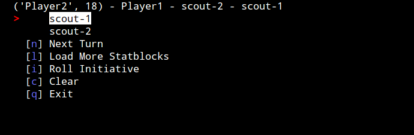
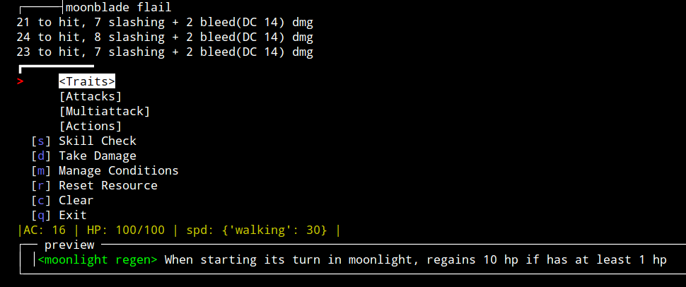

# DMhelper
Python Program to help me DM DnD stuf

## Statblock specification
Statblocks are written in either [yaml](https://yaml.org/) or [json](https://www.json.org/json-en.html) files.
They must follow a schema provided in [statblock.json](statblock.json) rather closely. For more info on the fields
and proper formatting, see [here](docs/schema.md) or the examples in `statblock-examples`.

## Basic Usage
Run using the `python src/main.py`, which accepts a number of args
- `--target` the directory containing the statblock files
- `--format` one of "yaml" or "json", specifies the file format to use
- `--num_pcs` the number of player characters, used for initiative tracker

## Loading menu

- `Continue` continues to main menu
- `Load More` will prompt for a list of stablock names
- `List Available` will list the files in the specified root folder and allow you to select one and choose how many of that statblock to load

## Main Menu

You can select any of the loaded statblocks which will bring you to the statblock menu,
each of the meta-options has a shortcut key
- `Next Turn` progresses the turn tracker (top of the screen)
- `Load More Statblocks` brings you back to the loading menu
- `Roll Initiative` initializes the turn tracker by rolling initiatives for the monster and prompting for PC intitiatives
- `Clear` will clear non-menu output
- `Exit` will exit the program

## Statblock Menu

Output will be inserted printed above the traits box. This will persist until cleared

Traits are shown in an enclosed box above the menu. AC, HP, and Speed are shown in a yellow status bar below the menu.

The menu shows actions as well as 4 meta-options. A preview for each of the actions is shown at an enclosed box at the bottom of the screen
- Selecting an action will roll any dice associated with the action and output above the menu
- `Skill Check` will run a skill check
- `Take Damage` will prompt you for damage to be dealt to the creature, when it's hp becomes 0 it will be deleted and removed from initiative
- `Clear` will clear the screen
- `Exit` will return to the main menu

# TODO
- [x] Implement to-hit rolls
- [x] Implement action rolls
- [x] Implement preview for actions and attacks
- [x] Remove dead monsters
- [x] Add monsters into initiative order
- [ ] Config
  - [ ] Number of players
  - [ ] YAML or JSON
- [ ] Improve menu layout
- [x] Add condition tracking
- [ ] 
